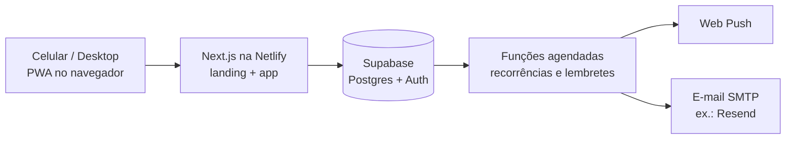
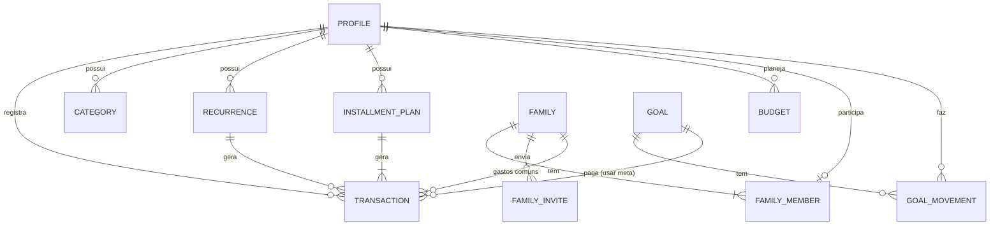
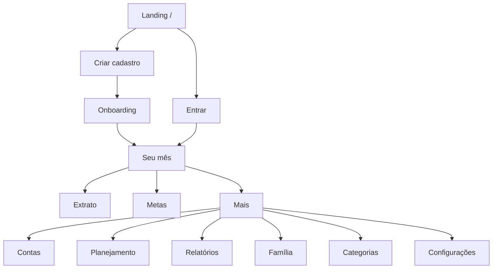
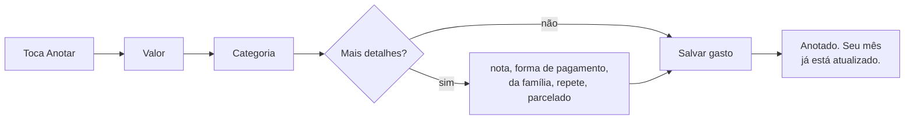
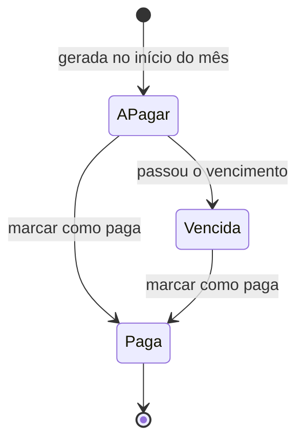
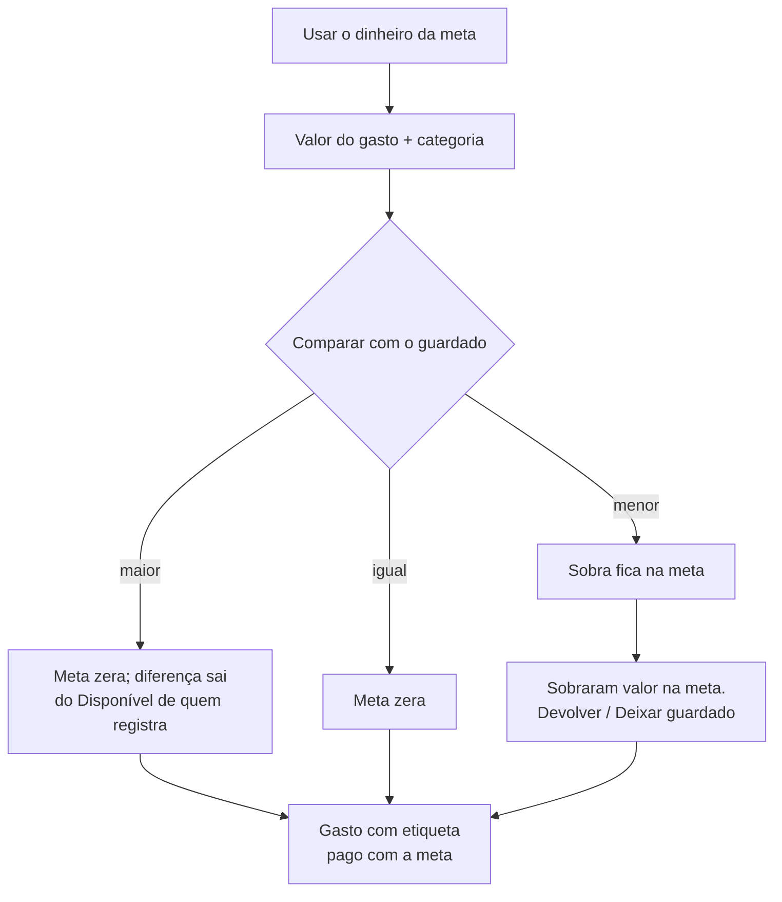

# Íris — Etapa 3: Arquitetura

Status: **APROVADA em 2026-09-22** ([wireframe](https://claude.ai/artifact/QcK2xcWBbikGoGQuwKnXQg)) · Versão 2 ·

**Decisões fechadas:** A1 B — conta paga com atraso sai do Disponível no mês em que foi paga · A2 A — mês do calendário · A3 A — na família, categorias padrão agrupadas pela `chave_padrao`, criadas pela pessoa pelo nome · A4 B — meta da família mostra o total e só a própria parte · A5 — barra inferior Seu mês · Extrato · Anotar · Metas · Mais · A6 A — meta excluída devolve o dinheiro ao Disponível do mês atual (na família, cada parte a quem guardou; só o administrador exclui) · A7 A — exportação em CSV · A8 — lembretes às 9h (Brasília) · Base: [Etapa 2 — Requisitos (aprovada)](etapa-2-requisitos.md)

Itens marcados com **[DECIDIR Ax]** precisam da sua escolha (lista no §10). O restante é proposta técnica minha, com o motivo ao lado — pode questionar qualquer ponto.

---

## 1. Visão geral



Um único projeto Next.js serve a landing (pública, otimizada para SEO) e o app (atrás do login). O Supabase guarda os dados, faz o login (e-mail + Google) e aplica as regras de privacidade **dentro do banco**, de modo que um erro na tela nunca exponha dado privado de outra pessoa.

---

## 2. Princípios técnicos

| Princípio | Por quê |
|---|---|
| **Dinheiro em centavos inteiros** (R$ 12,50 = 1250) | Evita erros de arredondamento de números decimais. |
| **Um livro-razão**: todo movimento de dinheiro é um registro; os números (Disponível, Saldo total, Guardado) são sempre calculados, nunca guardados prontos | Nada fica "dessincronizado". Editar ou excluir um gasto recalcula tudo automaticamente — é a promessa "Seu mês será recalculado". |
| **Regras de cálculo num único módulo** (`domain/`), sem acesso a banco ou tela, com testes automatizados | Atende RNF-11. As fórmulas RN-01 a RN-22 ficam em um lugar só e são testadas com cenários reais (incluindo o gasto pago com meta). |
| **Operações de vários passos no banco, de forma atômica** (usar meta, sair da família, quitar parcelas, excluir cadastro) | Ou tudo acontece, ou nada. Evita, por exemplo, zerar a meta sem registrar o gasto se a conexão cair no meio. |
| **Privacidade no banco (row level security)** | Cada consulta só enxerga o que a pessoa pode ver, independentemente do código da tela. |
| **Fuso fixo America/Sao_Paulo** | "Hoje", "este mês" e vencimentos seguem o horário de Brasília. |

---

## 3. Modelo de dados



### 3.1 Tabelas

| Tabela | Campos principais | Observações |
|---|---|---|
| **profiles** | id, nome, saldo_inicial, criado_em | 1:1 com o usuário do login. |
| **categories** | id, dono, nome, chave_padrao, ordem | As 10 padrão são **copiadas para cada pessoa** no cadastro, para ela poder renomear/excluir sem afetar ninguém. `chave_padrao` identifica as originais (ex.: `mercado`). "Outros" não pode ser excluída. |
| **transactions** | id, tipo (entrada/gasto), valor, data, categoria, origem (entradas), nota, forma_pagamento, **dono** (quem registrou), **familia** (se "da família"), **situacao** (confirmado / a pagar / a receber), vencimento, pago_em, recorrencia, plano_parcelas, nº_parcela, **meta**, **valor_pago_com_meta** | A tabela central. Um gasto pago com meta guarda quanto veio da meta; o resto veio do mês (RN-15a). |
| **recurrences** | id, dono, familia, tipo, valor, categoria/origem, descrição, frequência (mensal/anual), dia, mês (se anual), início, fim, ativa | Molde que gera as ocorrências "a pagar" / "a receber". |
| **installment_plans** | id, dono, familia, descrição, categoria, valor_total, nº_parcelas, data_compra, situacao (ativo / quitado / devolvido) | As parcelas são criadas de uma vez como gastos confirmados, uma por mês (RN-07). Centavos que sobram da divisão vão para a 1ª parcela. |
| **budgets** | dono, mês, categoria, valor | Planejamento individual (RF-22). |
| **goals** | id, nome, valor_alvo, prazo, **dono _ou_ familia**, situacao (ativa / concluída / usada) | Meta individual tem dono; meta da família tem família. |
| **goal_movements** | id, meta, **pessoa**, tipo (guardar / retirar / usar / devolvido na saída), valor, data, gasto relacionado | O Guardado de cada pessoa em cada meta = soma dos movimentos dela. É isso que permite a divisão proporcional (RN-22c) e a devolução na saída (RN-22d). |
| **families** | id, nome, criada_em | |
| **family_members** | familia, pessoa, papel (administrador/membro), entrou_em | Regra no banco: uma família por pessoa (RN-26) e exatamente um administrador. |
| **family_invites** | familia, e-mail, código, expira_em, convidado_por, aceito_em | Convite por e-mail ou link (RF-42). |
| **notification_prefs** | pessoa, tipo, ligado | RF-50. Lembrete diário começa desligado. |
| **push_subscriptions** | pessoa, endpoint, chaves, aparelho | Um registro por aparelho instalado. |
| **notification_log** | pessoa, tipo, referência, enviado_em | Evita mandar o mesmo aviso duas vezes. |

### 3.2 Como os números são calculados

Para uma pessoa e um mês:

```latex
\text{Disponível} = \text{Entrou} - \text{Saiu} - \text{Guardado líquido do mês}
```

| Número | Fórmula sobre os registros |
|---|---|
| **Entrou** | entradas confirmadas com data no mês |
| **Saiu** | gastos confirmados no mês − parte paga com meta (RN-01a) |
| **Guardado líquido** | movimentos "guardar" − "retirar" − "devolvido na saída" da pessoa no mês. Positivo → "Guardado este mês"; negativo → "Tirado das metas" (RN-01) |
| **Disponível depois das contas** | Disponível − contas "a pagar" do mês |
| **Guardado (total)** | soma de todos os movimentos da pessoa em todas as metas |
| **Saldo total** | saldo inicial + entradas confirmadas até hoje − gastos confirmados até hoje (parte paga pelo mês) − usos de meta atribuídos à pessoa |

Parcelas futuras já existem no banco, mas só entram nos números quando o mês delas chega. **[DECIDIR A1]** em que mês conta uma conta paga com atraso. **[DECIDIR A2]** o que define "mês".

---

## 4. Privacidade e permissões

| Dado | Quem vê | Quem altera |
|---|---|---|
| Registros individuais, planejamento, categorias, metas individuais | Só o dono | Só o dono |
| Gasto "da família" | Todos os membros (com o nome de quem registrou) | Quem registrou e o administrador (RN-21) |
| Conta recorrente da família | Todos os membros | Qualquer membro marca como paga (RN-20); criar/editar: quem criou e o administrador |
| Meta da família | Todos os membros | Guardar e retirar a própria parte: qualquer membro. Usar: só o administrador (RN-22b). **[DECIDIR A4]** quanto cada um guardou é visível para todos? |
| Disponível, Saldo total e entradas de cada membro | **Ninguém além do próprio** | — |
| Família (nome, convites, remoção) | Todos veem os membros | Só o administrador |

Todas as regras acima são aplicadas no banco. As telas apenas refletem o que o banco permite.

---

## 5. Processos automáticos

| Processo | Quando | O que faz |
|---|---|---|
| Gerar ocorrências | Todo dia, 00h05 (Brasília), e também ao abrir o app | Cria as contas "a pagar" e entradas "a receber" do mês a partir das recorrências ativas (mensais: no 1º dia do mês; anuais: no 1º dia do mês do vencimento). |
| Lembretes de contas | Todo dia às **9h** (proposta) | Push "vence amanhã" e "hoje é o dia". |
| Avisos de planejado e meta | Logo após cada registro | Push "quase no limite" e "falta pouco para a meta", no máximo uma vez por categoria/meta por mês. |
| Retomada | Diário | Mensagem sem culpa após alguns dias sem registro (quantos dias: definir na Etapa 4). |
| Resumo do mês | Dia 1, 9h | Push + e-mail "Seu mês de {mês} está fechado". |

Mês "fechado" é só um resumo: **nada é travado**. A pessoa pode anotar ou corrigir gastos de meses anteriores a qualquer momento, e os números se recalculam — coerente com "é só continuar de onde parou".

---

## 6. Estrutura de páginas



| Área | Endereço | Conteúdo |
|---|---|---|
| Landing | `/` | Seções 1–9 da copy. |
| Acesso | `/entrar`, `/criar-cadastro`, `/recuperar-senha`, `/nova-senha`, `/convite/{código}` | |
| Legal | `/termos`, `/privacidade` | Textos a produzir antes do lançamento público. |
| Onboarding | `/boas-vindas` | 3 telas, saldo inicial, instalar, primeiro gasto. |
| Seu mês | `/inicio` | Dashboard. Seletor **Eu · Família** no topo quando a pessoa tem família. |
| Extrato | `/extrato` | Busca e filtros. |
| Metas | `/metas`, `/metas/{id}` | Individuais e da família, separadas. |
| Contas | `/contas` | A pagar, pagas, vencidas; recorrências. |
| Planejamento | `/planejamento` | |
| Relatórios | `/relatorios` | |
| Família | `/familia` | Membros, convites, sair, transferir administrador. |
| Categorias | `/categorias` | |
| Configurações | `/configuracoes` | Perfil, saldo inicial, notificações, instalar, exportar, excluir cadastro. |

Ações rápidas abrem **por cima da tela atual** (painel que sobe no celular, janela no desktop), sem trocar de página: Anotar gasto, Registrar entrada, Guardar na meta, Usar a meta, Marcar como paga.

---

## 7. Navegação

### Celular — barra inferior (proposta, **[DECIDIR A5]**)

| Seu mês | Extrato | **Anotar** (botão central) | Metas | Mais |
|---|---|---|---|---|

- **Anotar** abre a escolha rápida "Saiu dinheiro / Entrou dinheiro", com "Saiu" já selecionado (é a ação mais comum).
- **Contas** e **Planejamento** também aparecem como blocos clicáveis no Seu mês, então raramente é preciso ir ao "Mais".
- **Família** entra no seletor Eu · Família do Seu mês e no "Mais".

### Desktop

Menu lateral fixo com todas as áreas e o botão "Anotar" no topo. O Seu mês usa duas colunas: números do mês à esquerda; contas, metas e planejamento à direita. Nada de telas esticadas do celular (RNF-02).

---

## 8. Fluxos principais

### 8.1 Anotar gasto (caminho mais usado)



Três toques no caminho curto: Anotar → valor → categoria (que salva). Data já vem como hoje.

### 8.2 Ciclo de uma conta recorrente



"Vencida" é só um estado visual e calmo (sem vermelho alarmante, sem "atrasada"), coerente com a copy.

### 8.3 Usar o dinheiro da meta



Na meta da família, só o administrador inicia esse fluxo, e o uso é repartido entre os membros na proporção do que cada um guardou (RN-22c).

### 8.4 Outros fluxos (detalhados na Etapa 4)

Criar cadastro e onboarding · Convite e entrada na família · Sair da família e transferir administrador · Quitar ou cancelar parcelas · Confirmar entrada a receber · Planejar o mês · Exportar dados · Excluir cadastro.

---

## 9. Organização do código

```
src/
  app/            páginas (landing, acesso, app)
  domain/         regras de cálculo puras + testes (RN-01 a RN-22)
  features/       uma pasta por área: registro, contas, metas, familia, ...
  ui/             componentes reutilizáveis (definidos na Etapa 5)
  lib/            conexão com Supabase, datas, formatação de R$
supabase/
  migrations/     tabelas, regras de privacidade e funções atômicas
  functions/      tarefas agendadas (recorrências, push, e-mail)
tests/            testes de ponta a ponta (fluxos principais, celular e desktop)
```

Ferramentas propostas: TypeScript, validação de dados com Zod (no formulário e no servidor), testes com Vitest (regras) e Playwright (fluxos no navegador). Biblioteca de estilos e componentes: decidida na Etapa 5, junto com a identidade visual.

---

## 10. Decisões que precisam de você

| ID | Pergunta |
|---|---|
| A1 | Conta paga com atraso: conta no mês do vencimento ou no mês em que foi paga? |
| A2 | "Mês" é o mês do calendário (1 a 30/31) ou começa num dia escolhido (ex.: dia do salário)? |
| A3 | Categorias na visão da família, já que cada pessoa tem as suas. |
| A4 | Quanto cada membro guardou numa meta da família é visível para todos? |
| A5 | Barra inferior do celular. |
| A6 | Meta excluída com dinheiro guardado. |
| A7 | Formato da exportação de dados. |
| A8 | Horário dos lembretes (proposta: 9h). |
